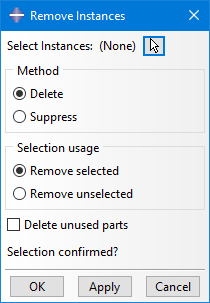

# Abaqus Plugin: Remove Instances
Plugin for Abaqus/CAE to easily remove/suppress instances from an assembly

 
More details:

In Abaqus/CAE it is not possible to select instances in the viewport to delete or suppress them. The selection has always to be done in the model tree. This makes it quite hard and time consuming to work on a large assembly, especially when it was imported and the instance names are basically the same.

My Plug-in overcomes this limitation and allows selection in the viewport. This enables the typical usage of the drag-box combined with the ctrl- and shift-keys. The Plug-in also allows reverse selection usage and suppressing instead of deleting. Additionally it can delete the parts that are now unused after instances were deleted.

The viewport selection makes it possible now, to reduce the displayed entities with the Display Group tool first. For example when a lot of standalone face and line parts were in the imported file and you want to get rid of them in Abaqus/CAE. You could now hide all cells with one Display Group action and delete all remaining instance in the viewport with one drag-box selection.

See also the demo video in the media folder.

 

Usage at your own risk.